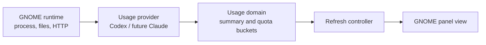

# Codex Usage for GNOME Shell

Display the remaining quota for OpenAI Codex in the GNOME top bar. The
indicator stays hidden until a `codex` process is running and the usage API has
returned a result. If the API request fails, it shows the normal battery layout
with empty (0%) batteries and a red `Fail` label instead of a percentage.

The usage value refreshes every 60 seconds (while Codex is running) and provides a menu with separate
quota windows for Codex and any additional models returned by the account API,
such as GPT-5.3-Codex-Spark.

## Architecture

The extension separates service, platform, and presentation concerns so a new
usage service can be added without changing the GNOME view.



- `src/providers/` owns provider-specific authentication and API parsing.
- `src/domain/` contains the provider-neutral quota model and error fallback.
- `src/platforms/` isolates GJS/GNOME facilities such as files, processes, and HTTP.
- `src/ui/` renders the GNOME view and formats quota text.
- `src/controller.js` coordinates provider polling and UI state.

A provider implements `isActive()` and `fetchUsage(callback)`, returning a
summary with `{ label, remaining, reset }` buckets. A Claude provider can use
the same contract; Windows and macOS clients can reuse the provider/domain
contract with their own runtime and tray/menu-bar view.

## Screenshots

### Success

The existing screenshot shows a successful usage API response.


### Fail

An API failure uses the same quota layout with empty batteries; each percentage
is replaced by a red `Fail` label.


## Requirements

- GNOME Shell 42
- The Codex CLI installed and signed in for the same Linux user
- Network access to `chatgpt.com`

Sign in if necessary:

```bash
codex login
```

The extension reads the access token from `~/.codex/auth.json`. It never
stores the token in the extension directory or sends it anywhere except
`https://chatgpt.com/backend-api/wham/usage` to retrieve usage information.

## Install from GitHub

```bash
git clone https://github.com/YOUR_GITHUB_USERNAME/codex-usage-gnome.git \
  ~/.local/share/gnome-shell/extensions/codex-usage@local

gnome-extensions enable codex-usage@local
```

Restart GNOME Shell after enabling:

- **X11:** press <kbd>Alt</kbd>+<kbd>F2</kbd>, type `r`, and press Enter.
- **Wayland:** log out and log back in.

## Update

```bash
git -C ~/.local/share/gnome-shell/extensions/codex-usage@local pull --ff-only
```

Then restart GNOME Shell using the appropriate method above.

## Use

- The top bar shows each available quota window as a battery and percentage.
- Click the indicator to view all detected quota windows and their reset times.
- Choose **Refresh now** in the menu to fetch the latest usage immediately.

If the API does not return a specific window, the extension does not display a
made-up value for it.

## Troubleshooting

Check whether GNOME loaded the extension:

```bash
gnome-extensions info codex-usage@local
```

If its state is `ERROR`, inspect the current session log:

```bash
journalctl --user -b --no-pager | grep -i codex-usage
```

If the indicator displays `Fail`, verify that `codex login` has completed
successfully and that the computer can reach `chatgpt.com`.

## Development

The extension consists of only these runtime files:

- `extension.js` — panel indicator, token lookup, usage request, and rendering
- `metadata.json` — GNOME Shell extension metadata
- `install.sh` — enables the extension after a local install

To test a change, disable and re-enable the extension, then restart GNOME
Shell:

```bash
gnome-extensions disable codex-usage@local
gnome-extensions enable codex-usage@local
```

## Security and privacy

Do not commit `~/.codex/auth.json`, an access token, or screenshots containing
personal account details. See `.gitignore` for local-file protections.
